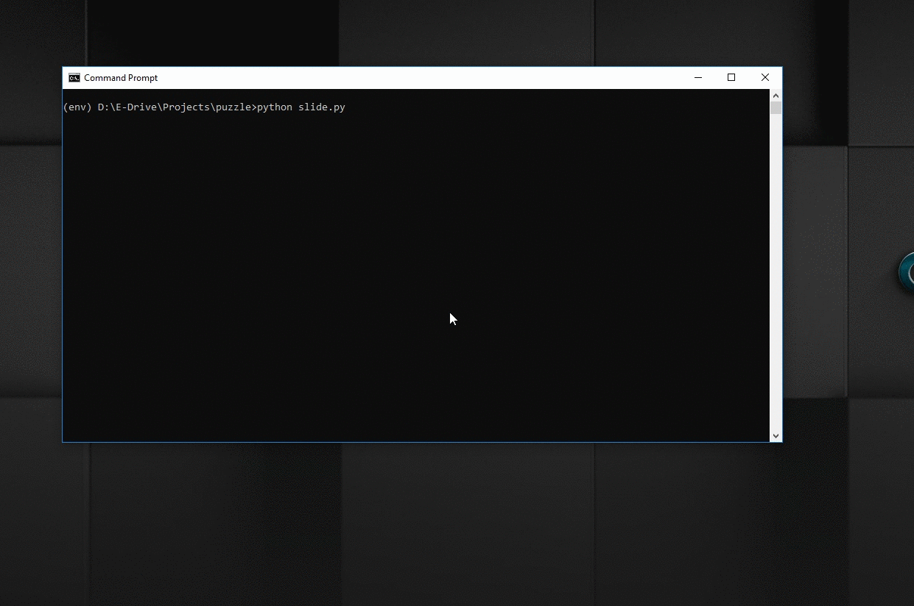

# Image-Puzzle
Python program that turns an image into block puzzle, Controlled by mouse click to solve.



### Prerequisites

Project is tested on Python 3.5 & requires Pygame 1.9.6 you can install it using following command
```
pip install pygame==1.9.6
```

### Running
```
python slide.py
```
